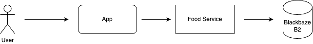
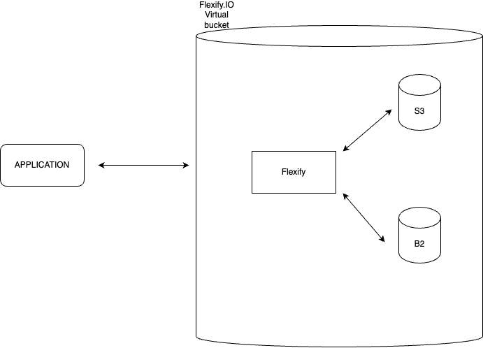

# 🧬 Storage Migration

## 🏛️ Structure

### 1. 🎯 Problem Statement and Context

What is the problem? What is the context of the problem?
Example:

```
Food and Co is a food company that is using AWS S3 to store their food data.
It has started to be too expensive for the company though.
It is needed to create a new architecture and also migrate out of S3 in a smooth way.
```

Recomended Reading: http://diego-pacheco.blogspot.com/2021/10/breaking-problems-down.html

### 2. 🎯 Goals

List in form of bullets what goals do have. Here it's great to have 5-10 lines.
Example:

```
1. Solution needs to be cheaper than current (AWS S3)
2. Transition needs to be smooth
3. We need a new architecture
4. It needs to keep the same functionalities as it has today (analytics, image store, machine learning,...)
5. It needs to be out of S3
```

Recommended Learning: http://diego-pacheco.blogspot.com/2020/05/education-vs-learning.html

### 3. 🎯 Non-Goals

List in form of bullets what non-goals do have. Here it's great to have 5-10 lines.
Example:

```
1. Simple service replacement: we also need to create a new architecture
2. New application: we need to keep our current data while doing the migration
```

Recommended Reading: http://diego-pacheco.blogspot.com/2021/01/requirements-are-dangerous.html

### 📐 3. Principles

List in form of bullets what design principles you want to be followed, it's great to have 5-10 lines.
Example:

```
1. Data Integrity: We can't loose any data while doing the migration
2. Backup: We need to have a way to backup if any of the migration process fails
3. Isolation: Storaging should be as isolated as possible from implementation, so it can be migrated in the future again
4. Scalability: Just like S3, our storaging needs to easily scale for tons of data
5. Availability: We need to have availability along multiple regions just like S3.
```

Recommended Reading: http://diego-pacheco.blogspot.com/2018/01/stability-principles.html

### 🏗️ 4. Overall Diagrams

Here there will be a bunch of diagrams, to understand the solution.



Recommended Reading: http://diego-pacheco.blogspot.com/2020/10/uml-hidden-gems.html

### 🧭 5. Trade-offs

Major Decisions:

```
1. S3 vs Blackbaze B2
PROS (+)
  * Lower cost on B2: $6 / TB / MONTH vs 23 / TB / MONTH
  * S3 API Compatible: S3 can easily be replaced with B2
CONS (+)
  * Speed: There are reports of slower speed compared to S3 for large workloads

1. Manual migration vs automated with tools like Flexify.IO
PROS (+)
  * Automated: Blackbaze will pay the transfer fees
  * Automated is Faster than manual
  * With manual migration you have more control of what is being passed
  * Flexify will automatically check for updates in data and send only updated data to new storage
CONS (+)
  * High risk of manually creating a script
  * Downtime needed for manual migration
```

PS: Be careful to not confuse problem with explanation.
<BR/>Recommended reading: http://diego-pacheco.blogspot.com/2023/07/tradeoffs.html

### 🌏 6. For each key major component

```

- Storage layer - Blackbaze B2 Cloud Storage
  - Primary data repository
  - Low cost s3-compatible APIs
  - Redundancy: Each file is stored redundantly across multiple drives, in multiple servers, in multiple locations in the data center.
- Data access layer - API in EC2
  - Abstracts interation with B2
  - Manages access
  - Caching (i.e Redis to speedup frequent requests)
  - Interface compatible with any clients
- Caching with Redis
  - Stores frequently accessed data for faster response
- Load Balancer
  - Distributes traffic
  - Direct traffic to health EC2 instances
  - Least connections strategy to deal with file processing from B2

6.1 -               : classic uml diagram with attributes and methods
6.2 - Contract Documentation     : Operations, Inputs and Outputs
6.3 - Persistence Model          : Diagrams, Table structure, partiotioning, main queries.
6.4 - Algorithms/Data Structures : Spesific algos that need to be used, along size with spesific data structures.
```

Exemplos of other components: Batch jobs, Events, 3rd Party Integrations, Streaming, ML Models, ChatBots, etc...

Recommended Reading: http://diego-pacheco.blogspot.com/2018/05/internal-system-design-forgotten.html

### 🖹 7. Migrations



### 🖹 8. Testing strategy

- Manual testing - Since we're working with images, manual test will be the most accurate way to check key images weren't lost
- AI Assertions - As the storage is beingused for machine learning, we could compare results from previous S3 storage and B2 storage to see if we get same results using same thresholds

### 🖹 9. Observability strategy

Explain the techniques, principles,types of observability that will be used, key metrics, what would be logged and how to design proper dashboards and alerts.

### 🖹 10. Data Store Designs

For each different kind of data store i.e (Postgres, Memcached, Elasticache, S3, Neo4J etc...) describe the schemas, what would be stored there and why, main queries, expectations on performance. Diagrams are welcome but you really need some dictionaries.

### 🖹 11. Technology Stack

Describe your stack, what databases would be used, what servers, what kind of components, mobile/ui approach, general architecture components, frameworks and libs to be used or not be used and why.

### 🖹 12. References

- Architecture Anti-Patterns: https://architecture-antipatterns.tech/
- EIP https://www.enterpriseintegrationpatterns.com/
- SOA Patterns https://patterns.arcitura.com/soa-patterns
- API Patterns https://microservice-api-patterns.org/
- Anti-Patterns https://sourcemaking.com/antipatterns/software-development-antipatterns
- Refactoring Patterns https://sourcemaking.com/refactoring/refactorings
- Database Refactoring Patterns https://databaserefactoring.com/
- Data Modelling Redis https://redis.com/blog/nosql-data-modeling/
- Cloud Patterns https://docs.aws.amazon.com/prescriptive-guidance/latest/cloud-design-patterns/introduction.html
- 12 Factors App https://12factor.net/
- Relational DB Patterns https://www.geeksforgeeks.org/design-patterns-for-relational-databases/
- Rendering Patterns https://www.patterns.dev/vanilla/rendering-patterns/
- REST API Design https://blog.stoplight.io/api-design-patterns-for-rest-web-services
